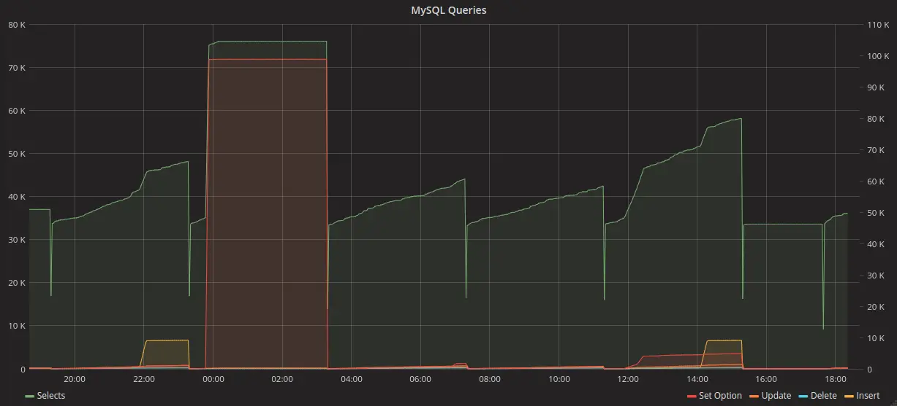
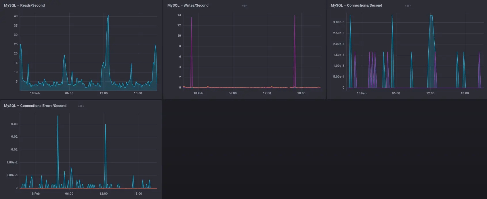

It cannot be denied that Redbrick’s services have been a bit wonky recently. Our uptime has been all over the place and our systems have been crumbling. As much as we would love to blame this on our hardware, this is not the case. RB’s tech stack has been a spaghetti monster for quite some time, having multiple appendages added to it over the years. Sufficient time has not been committed to keeping things up to date, and the tech debt has finally caught up with us in a major way.

SELECT issues FROM mysql\_history;
----------------------------------

It was diagnosed some time in 2018 that the reason for the intermittent down time of a number of our sites was our single all-serving MySQL 5.5 instance. This runs our our server Metharme - a Ubuntu _12.04_ box with quite a beefy spec which houses our Apache sites, MySQL and a plethora of other services, all deployed monolithically on the bare metal. Needless to say, any updates to this box are a feat of human engineering.

In November things became desperate. We had to restart the MySQL instance every 3 hours or so to keep our services online. We tried using a cron job to automate this (which was a bad enough idea already) but to our horror we discovered that cron is broken on Metharme - an issue for another day.

On top of the monitoring alerts themselves, we started to receive a lot of emails from our users stating that their site was down, to the point where we built up some 10-mail threads with people in a mixed attempt to resolve and diagnose the issues. Something else had to be done.

SELECT \* FROM investigation;
-----------------------------

Diagnosing this failure was very difficult. There are hundreds of websites on Redbrick’s infrastructure which rely on this service. There are also hundreds of databases in our MySQL instance, some of which date back to MySQL 4.X. Narrowing down a culprit was akin to finding a needle in a haystack. From space.

Below you can see our MySQL Queries counter which clearly shows our 3-hour restart hack. Where it flatlines is where the service was down.



#### Metharme Stats

None of our graphs indicated any sort of hardware limitation to be the culprit, and our only idea at this point was to (at least try) upgrade our instance. The apache logs and metrics were no help either as we do not have per-site insights into our performance (since we only have one Apache instance).

UPDATE mysql SET version = 8.0;
-------------------------------

Updating MySQL in-place wasn’t an option. The latest available package for Ubuntu 12.04 was already installed on Metharme. The best thing we could do was deploy MySQL containerised onto Zeus, our container server, and redirect traffic to it.

There was a lot of discussion around what version to use. We looked at MySQL 5.7 and 8.0, MariaDB 11, and Percona 8.0. The logic was that if we were going to upgrade to a breaking version with some confidence, it would be Percona. Should that fail catastrophically we would bring it up to MySQL 5.7. Maria was quickly ruled out as an option as it cannot replicate between MySQL and itself due to some breaking changes in its design (namely GTID changes).

Putting it in a container specifically was only a means to fulfil the task. We ended up attaching a bridge network and giving the container a “real” IP address on our network - one which looks and behaves like a baremetal host. This means that we have an IP address for mysql which can “float” to wherever, or whatever, is hosting the instance, and also doesn’t complicate our routing any further.

Another goal was to “actually” update the databases. This meant maintaining as many defaults as possible in the new instance - such as the `SQL_MODE` which controls what sort of error tolerance it provides. We only needed to set the following things in the end:

```
[mysqld]
default_authentication_plugin=mysql_native_password
character_set_server=utf8mb3
collation_server=utf8mb3_unicode_ci

```

As it turns out, there’s almost no PHP support for the newer password hashes, and on top of the work required to convert the old passwords this ended up being a necessary change.

UPDATE mysql SET host="Zeus”;
-----------------------------

This upgrade had to be seamless. Shutting down MySQL (despite the terrible uptime) wasn’t an option until the replacement was production ready.

In order to pull this off, we restored a backup from Metharme to Zeus and enabled replication from the old to the new instance. Despite the countless warnings and edge cases painted all over the documentation, this worked almost perfectly. I say almost - as some tables were so old they couldn’t be restored and others were corrupt in the 5.5 instance itself. Of the ~584 databases we have, only 12 ended up being left behind.

Once the backup + replication was setup and working, we began testing a few sites on the new instance. One of the first was [the wiki](https://wiki.redbrick.dcu.ie/mw/Main_Page), which went perfectly. After changing the MediaWiki configs we were immediately able to read and change wiki entries on the new instance.

Next we moved a random tribute member’s site. The webapp they are using is called [Koken](http://koken.me/) and provides an image gallery blog. It’s the perfect outdated PHP worst-case scenario for the test, and after changing some compatibility flags in Percona 8.0 and changing the `SQL_MODE` for the app’s connections it worked fine!

INSERT INTO mysql\_history(result,issues) VALUES (“SUCCESS”, 0);
----------------------------------------------------------------

Fortunately the admins of old made at least one good decision. MySQL has its own DNS entry, and all our services are referencing it. In order to switch everything to the new instance all we had to do was update the DNS entry to point to the new IP address and it would “just work”.

To our own surprise and relief, this turned out to be true. After changing the address it took us a moment to verify if the switch had actually been made, as the only visible difference was in the graphs on either side. Every site appeared to continue operating normally.

DROP DATABASE metharme;
-----------------------

With the DNS now switched, there was no real turning back. Data was already writing to the new instance and not being replicated back to MySQL 5.5. With that, we immediately shut down Metharme MySQL. Most would consider this an insane move given the whole 30 seconds of testing we had between the DNS switch and the shutdown of the old instance, but we were confident that our new instance was operating normally and it was safe to do so.

Metrics on the new instance have been deceptfully low, however. Here’s a screenshot of our metrics the day this post was made.



#### Zeus Stats

As you can see, we’re seeing a fraction of the traffic we had before, and things are just as performant as they always were. This would suggest that the service(s) to blame for killing 5.5 were either hard coded to use the old IP address or aren’t compatible with Percona 8.0.

To this date, we have encountered no issues with MySQL nor have any users contacted us about any site issues. It’s safe to say, MySQL is fixed.

m1cr0man && The admin Team
