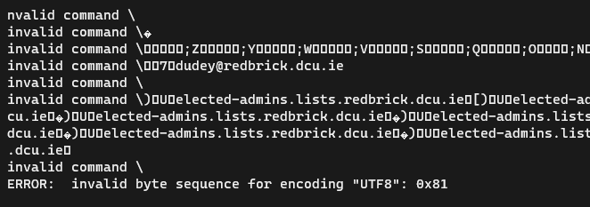
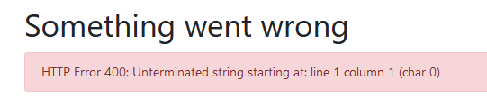

This document aims to outline key events and conclusions involved in fixing Redbrick's Mailman to return it to an operational state.

## Intro - Episode 1: "The Phantom SQLite"

The original Mailman system was deployed using an SQLite database on Hardcase. SQLite does not support concurrency and began running into locking problems. It became clear after it started spewing errors out and becoming unusable that a more robust solution was needed.

After some curious questions from the newly elected, enthusiastic but oblivious admins, it was decided that PostgreSQL would be the chosen solution. The admins set out, young and innocent, to fix the problem, not knowing what awaited them…

## Episode 2: Attack of the Invalid Byte Sequence

We exported the database from SQLite to our test VM, ready to import it into the test Postgres database we had set up, as a sort of dry-run to prepare for the downtime the following day, where we intended to deploy the real fix.

As soon as we loaded the database dump into postgres using [`pgloader`](https://github.com/dimitri/pgloader), we got bombarded with extremely long errors, saying nothing but..

**Yikes.** What does that mean? Surely some weird special character is messing up the importing.

We set out to inspect the human-readable data in PyCharm (lol) to see if we could find the offending character (*a backslash*, after a quick google search of the error), but to no avail. Nothing in the imported data seemed to be out of place. The encoding of both databases was the same too, so what was wrong?

We decided to export the data in some other format, like CSV. Cormac assisted us in using pgloader scripts to try to import this data, as this would allow us to perhaps escape the backslash characters causing the problem. This yielded the same result. What if we exported to json.. or, or maybe…? - we were frustrated by now.

We were so close.. As it turns out, Mailman stores some data as python Pickle's, in the form of byte arrays. *"Why?"* you may ask, fuck me if I know, but it was a royal pain by now trying to import this data. Everyone was getting impatient and the "lets just make a new database please" crowd were growing stronger. 

## Episode 3: Revenge of the SQLite Dump

Kyle joins the call - curious about our progress. Morales low and all the straws grasped by now, we had no idea where to go. In a wonderful shift to the narrative, Kyle begins to dump the database into a MySQL compatible dump format, and we import it..

Oh my fucking god. There's no errors.. it's running for a while.. that's good right? Almost. We successfully imported the dump into the database, however as it turns out, some of the tables had relations to each other that were lost in the dump process. This prevented the database from working fully. On top of this, SQLite's database fields were not nearly as descriptive and varied as Postgres, causing Postgres to assume data types, causing casting errors later on.

Conor fortunately solved this by letting Mailman create the tables itself, with the field type's it needed, to prevent such errors from occurring. He then imported each table one by one, ensuring that the top-level tables with no relations were inserted first, and then tables that had relations to the top-level ones. Things were looking good!

## Episode 4: A New Hope

With Mailman now being *this* close to being functional, we began to have some faith. We were soon faced with permissions errors, insertion errors, and similar problems alike, however with some quick googling they were trivial to solve.

Mailman was now up and running for the first time without any errors, and it was time to test if it could deliver mail properly. User-to-user mail worked just as intended, but as we emailed a mailing list, sitting anxiously for it to appear in our Inbox, a faint realisation began to overcome us. As we hurried to check the logs, we saw it… something hideous… a Django stack trace.

## Episode 5: The Mailman Strikes Back

After hours of googling and debugging, frantically trying to battle our inner *"FUCK DJANGO"*'s, and trying to fit a Django stack trace into the fucking google search bar, we found the problem. Mailman was failing to insert new data into row 1, or 7 or something of the table. Wait what? Row 1? Didn't we just import hundreds of rows worth of tables?? Why was it ignoring all of that data (you bet we hurried to check if we had accidentally just wiped postgres), and thinking the table was near empty?

Fucking Django is the answer. Did I mention I don't like Django? It turns out Postgres, or well, Mailman, relies on Django to have a cache of the sequence Id for the primary key column of a table. This cache doesn't update when you happen to import thousands of rows of data into the database, without an explicit SQL command. : ))))))))))))))))

After some googling, we found a simple command to reset this sequence to the actual number of rows currently in the table. With the sequence and insertion errors now fixed, we were on our merry way.

We ran a test, sure enough the mailing list mail arrived directly to our inboxes with no hideous stack traces accompanying it!!!!!!! This day is amazing, oh my god nothing can go wrong now lol this is perfect. We just fixed Mailman fuck me I'm on top of the world… no more discord pings rubbing it in that we need to fix Mail :weary: :weary: :weary: :weary:

## Episode 6: Return of the Invalid Byte Sequence

As we happily skipped along our theoretical road and began to ask the Oldmins, "well how do we update these mailing lists now to add new people?", we opened https://lists.redbrick.dcu.ie to find something even more hideous than a Django error (something worse than that should be illegal tbh), lo and behold, a JSON error.

Wow what a specific and helpful error! Boy this sure will help me debug the exact cause  of the problem due to the enormous amount of detail this error provides, I can't wait to fix this problem!

Armed with the adrenaline of having fixed Mail and having sent out a redbrick-announce email to a few thousand people telling them about it, and an Old man named Ben, we were determined to find the cause. We pulled out good old PyCharm to have a looksie around the database tables related to lists, and wow, would you look at that, it's that same Python Pickle byte array thing that was annoying us earlier!

Honestly speaking, I'll save you the pain of how we tried fixing this, because to be quite frank I don't even remember anything about the **4** hours we spent in a call staring at byte sequences, translating them to strings, replacing them with something that wouldn't cause a problem, and so on. We couldn't keep doing this and it was unsustainable for our sanity to trial-and-error our way out of this. Maybe if we had Mason instead of Ben with us we could've understood what the numbers meant.

## Episode 7: The Braincell Awakens

Why were we still messing around with this stupid piece of software? How about we make new Mailing lists for the important things, like committee, helpdesk, and webmaster? God if only I had thought of that before spending 4 hours staring at a terminal the night before. That's time none of us are getting back.

Armed with the approval of the smelly old men in the `#rootholders` retirement home, the pressure of the poor old committee tired of Hamzah sending 50 emails with nothing but gibberish in the name of 'testing' to unsubscribe them from the pain of push notifications, and the support of The Great Lucas, we set out to replace the old mailing lists.

We also set up forwarding with Postfix aliases in NixOS so that we could get any email addressed to the old ones, sent to the new ones. A slight recursion problem and over 9000 emails held for review later, we managed to figure out that having the postmaster user as the owner of the list, and also sending the postmaster bounce emails, wasn't a good idea.

## Conclusion

The only conclusion I can draw from this is that I never want to hear the words "SQL" or "invalid byte sequence" ever again. Please.

We managed to fix all the errors we faced (or create workarounds for the ones we couldn't), and now had a fully functioning Mailman on our hands with all the things we care about running smoothly. Cheers to not hearing "fix mail" every hour.

