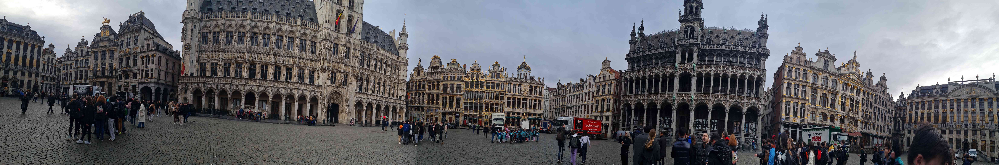
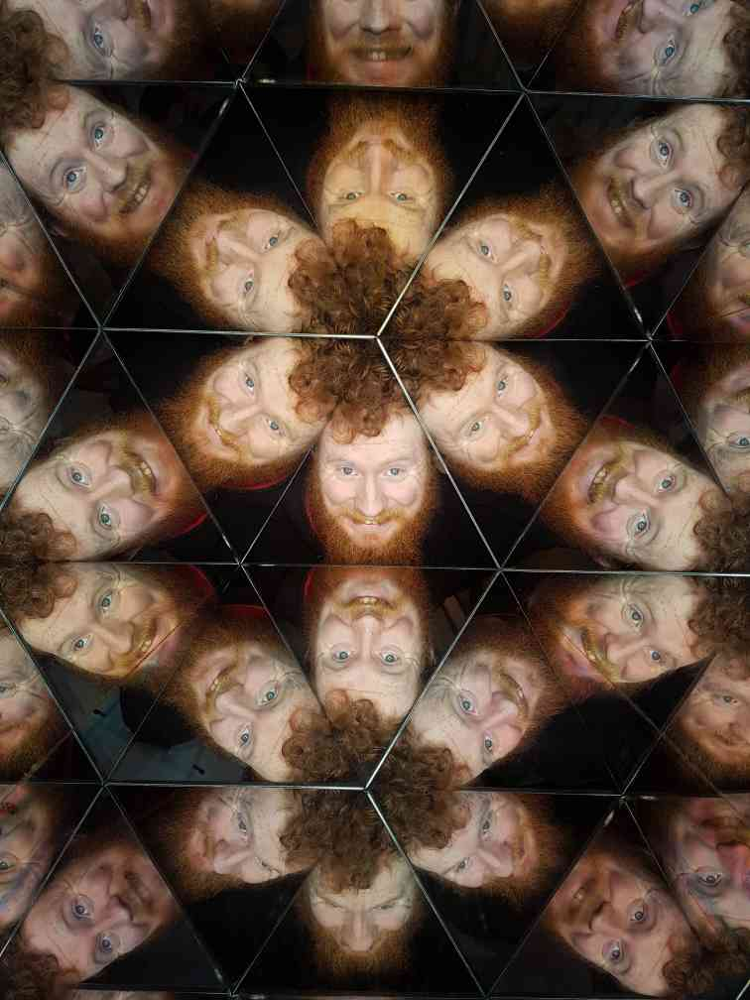

Once a year, every year (almost), Redbrick makes a pilgrimage to the tech conference to end all tech conferences: FOSDEM.

Located in the scenic city of Brussels, Belgium, FOSDEM happens at the start of February every year. It is a rite of passage for brickies; you haven't earned your brick until you've witnessed the carefree widdling of the Manneken Pis, or had a few scoops in Delirium - not to mention collected more than a few hexagonal stickers at the main event itself.

## DAY 1 - 2nd February 2023

After months of painstaking planning, grappling with C&S and cutting up debit cards, the trip is finally about to happen. Of course, I wasn't on the committee at this time, and was more than happy to reap the fruits of their labour. 

At around 5PM, the brickies convened outside Terminal 2 in Dublin Airport. Those who hadn't organised their boarding passes were promptly instructed to do so, but after making sure all the ducks were lined up, Andreea was happy to lead us to the Burger King for a quick pre-flight snack. Not everyone was satisfied with just a burger and chips, though. Tell me, have you ever had a pint of Guinness?

After a quick hop across the water, it was straight onto the train for the brickmeisters, and a double-decker, no less. Naturally enough, everyone scrambled for the top deck to continue the shenanigans that had been interrupted by the flight.

Nice glasses, Phil. You wouldn't be about to offer me a red or blue pill?

After arriving on the right side of Brussels, we made our way to the hotel. As soon as we had acquainted ourselves with our rooms, we were out on the streets, exploring the city. 

A few bricklets found Tier scooters which could be used for free for a time, to get around on.

Finding we hadn't spent enough time in the hotel, we made our way back inside to scope out the menu. Much to our delight, drinks were on offer. We decided to kick back for a while and order up. I got a nice cider, though unfortunately I lack any ability to pour.

Not a particularly flattering picture on either count.

The exploration continues…

After a quick scout around outside earlier, we had found a playground next door. Being the children we are, we decided to take a quick gander, and some of the more nimble among us decided to brave the climbing tower.

 Shane and Boris, A.K.A. `pluto` and `watz`

At this point in the night, most had retreated to their bunks, and were sleeping soundly.

**Day 2 - 3rd February 2023**

After a quick breakfast, the adventures continued. At this point, the brick enclave was split into a number of smaller brick troupes, to cover more ground and explore the city through many eyes. My group consisted of Leo, Frankie, Dzastina, Malachy, and of course, yours truly.

Our first stop was Brussels Main Square, a stunning example of some of the architecture to be seen in the city. 

From left to right: `arkues`, `bones`, `fbaxter`, `orb`.  `skins` behind camera.

The fact the tops of the buildings shown above are getting cut off is by no means intentional - they really are they immense.

After admiring the views there, we moved on to the Museum of Illusions, for just a smidgen of tomfoolery…

Yum.

The Fly but tamer. Even so, an amalgam of myself and Leo - a scary prospect.

Shun the gravity-obeyer!

No escape…

Moving swiftly on from the terrifying prospect of being stuck in a Malachy-prism, we moved along to the Manneken Pis. He's just a lil' guy. Just a eensie-weensie dude in need of the loo.

Frankie particularly enjoyed our visit, probably owing to the fact the Manneken Pis was looking particularly dapper on this occasion. 

Finding ourselves with plenty of time left, and plenty of chocolate-themed attractions nearby, we made our way to the Chocolate Museum.

Someday I hope to be half as cool as this French bulldog made of chocolate.

Old metal moulds used for making chocolate figures. Quite cool, all the ones I've ever seen used have been plastic.

At the end of our tour, we got to try some single-origin chocolates; chocolate where all the beans used to make them have been sourced from single locations, as opposed to blended like most chocolate. 

After finishing up and leaving the museum, we spotted a Ferris wheel in the distance. It was still pretty early at this point, we made the decision to walk to it. 
