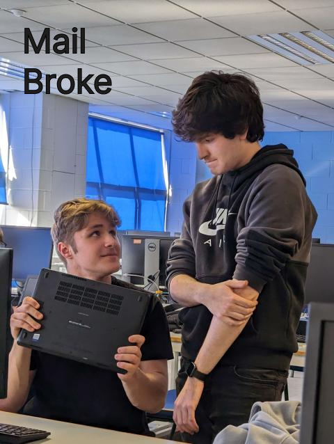
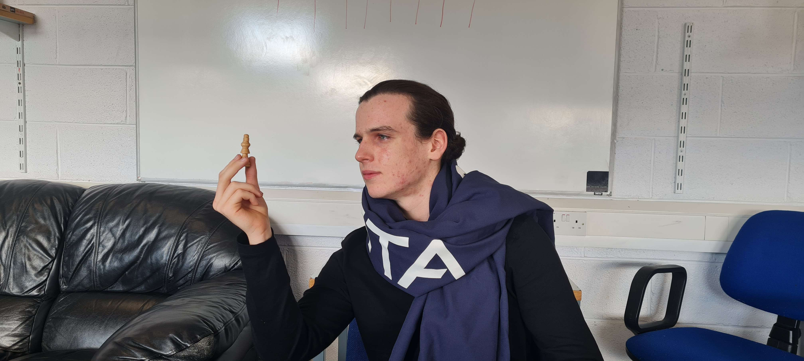

So what *is* it that Dominic is really doing behind the scenes, aside from breaking Redbrick's mail and playing the guitar? 

We all know Cathal is the real brains behind the operation, just look at that face, contemplating his next move.

Well, in this week's event we got a peek into some of the work that goes into making Redbrick's services tick, and why Nixos is by far all the sysadmin's favourite operating system! Everybody loves Nixos, right James?

Dope wars is well on the way to being a brickie favourite, with a certain someone stealing my immaculately crafted excel document to top the leaderboard…

Some, however, stick to Solitaire, surreptitiously stacking cards under the noses of the resident committee. 

All in all, a successful event, with the only complaint being that there was no Hawaiian pizza served, in spite of the fact that is it both an affront to pizza, food and Italians everywhere.

We'll be ordering it next time all the same.
