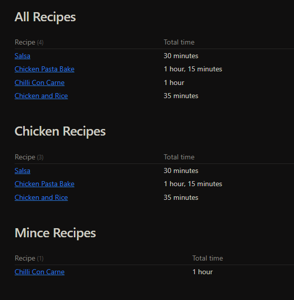

So, you want to take some notes. You open up a text editor or take out a pen and paper and start writing, great! But a few days go by and you've forgotten that you even took a note, or lost where you put it. Not so great. Luckily, in today's world of computers, persistence of text data is really easy, and really cheap. Let's talk about that.

## Why Take Notes?

Everyone takes notes in some form or other at some point in their life or other. Human brains are really good at forgetting information (or at least, mine is). That's why we write things down, or tell someone else about it so they can remind us about it.

A great example is a recipe book. People write recipes down so they can pass the information on to another person, so they don't forget a key ingredient, so they know what to buy when they go to the supermarket. Paper is great for this! It's as malleable as you need it to be, not confined to constraints about text size and other things, and formatting on it is really easy. However it is flawed in that you have to carry that piece of paper with you all the time. Enter ~~sandman~~ markdown.

## Markdown

Markdown is a computer file format that is essentially a glorified `.txt` file. It uses special symbols (or syntax) to inform styling instead of proprietary rich-text formats like Word or Google Docs. This makes it _super_ transportable. You can edit markdown files in _any_ text editor.

I won't go into detail about how to actually write markdown, [GitHub](https://docs.github.com/en/get-started/writing-on-github/getting-started-with-writing-and-formatting-on-github/basic-writing-and-formatting-syntax) already have a pretty good guide on it. What I am going to talk about is what I use to edit markdown, and the tools I use to enhance it.

Before we get into the configs though, it is important I mention how I sort my notes. I use a method called the [PARA](https://fortelabs.com/blog/para/) method. It breaks notes into one of 3 categories: Projects, Areas and Resources. Archive makes up the final piece of the acronym, used for projects that have been completed, or things I no longer need access to quickly. Crucially, everything in my vault is searchable. This means I can always find something if I have a note on it taken at some point in the past.

## Obsidian

[Obsidian](https://obsidian.md) is a text editor, specifically a markdown text editor. It uses local storage first so your notes are private (but you can back them up in many ways), it has community plugins which extend and enhance your note taking experience, and most importantly it looks really cool.

There are mobile and desktop applications, but as I say you don't need to exclusively use Obsidian to view your notes. You can use `vim` or `nano`, or even VSCode (with the [foam](https://github.com/foambubble/foam) extension) to view and modify your [digital garden](https://maggieappleton.com/garden-history). Obsidian is just what I've chosen.

### Obsidian Plugins

I use a few plugins to help me along the way, I'll go into detail about some of the later on, but for now I'll give an overview.

- [Table editor obsidian](https://github.com/ganesshkumar/obsidian-table-editor) - useful tools to enhance modifying tables
- [Obsidian linter](https://github.com/platers/obsidian-linter) - a formatter for markdown that enforces a style. Useful for adding meta data and frontmatter to notes also.
- [Obsidian dataview](https://github.com/blacksmithgu/obsidian-dataview) - powerful SQL-like syntax that turns your obsidian "vault" into a database. More on this below.
- [Obsidian tasks](https://github.com/obsidian-tasks-group/obsidian-tasks) - tools for managing tasks. Adds things like date created, completed, sorting of tasks, etc.
- [Obsidian git](https://github.com/denolehov/obsidian-git) - this is what I use to back up my vault. I commit ~once a day per machine.
- [Cycle through panes](https://github.com/Vinzent03/tab-switcher) - forces obsidian to change how `CTRL+ TAB` works to be more like a web browser (more recent files first)
- [Omnisearch](https://github.com/scambier/obsidian-omnisearch) - really powerful and really fast text searcher. Essentially `grep` for your notes.

I also use one or two other plugins for appearance

- [Obsidian minimal settings](https://github.com/kepano/obsidian-minimal-settings) - allows you to use a minimal theme and change certain aspects about it easily.
- [Obsidian view mode by frontmatter](https://github.com/bwydoogh/obsidian-force-view-mode-of-note) - allows you to set the viewing mode of a note through frontmatter. Useful for notes you reference often but don't change often.

All of these plugins combine to give me a generally smooth experience writing and modifying notes. None of them introduce anything that is non-standard (except the Obsidian Dataview) so my notes can be carried over if Obsidian ever becomes unmaintained.

For the most part, the plugins are left configured as default. There are one or two special cases where it's configured differently (mainly in Linter) to be more in line with what I expect. If you want to get the exact details of my plugins, send me a ping on Discord!

### Dataview

I make heavy use of dataview for my homepage. It allows me to collate tasks together, grouped by filename, sorted by date due. I can view what projects I'm working on at the minute, what tasks I have created (and completed) today and some stats on how big my vault is.

#### Task List

```
TASK FROM "1 - Projects" OR "Ingest" OR "2 - Areas/Homelab"
WHERE due <= date(today) + dur(1 week) AND !completed
SORT due ASC
GROUP BY file.link
```

This snippet collects every task I have marked as not yet completed inside my Projects and Areas/Homelab directory. This is largely where the tasks I create are placed. The filter is necessary due to the fact that my recipes also use tasks to note the ingredients. We end up with something that looks like this. The number beside the blue link is the count of tasks in that file.


I also have a section called "Tasks completed today" which is purely used for a dopamine hit.

#### Recently Edited Files

```
TABLE modified as "Modified"
FROM "" and -"Home.md" 
SORT modified DESC
LIMIT 10
```

Sometimes it's nice to see a list of recently edited files. It means you can view quickly where you last left off on something, and may mean that you remember to finish something you were doing.


Of course, this is again optional and not crucial to me taking notes.

#### Cookbook/Recipes

I store recipes in my vault so I always have access to them and their ingredients to generate a shopping list (see [[My Obsidian Configs#Shopping List|Shopping List]]).

```
TABLE WITHOUT ID
file.link as "Recipe", 
prep-time + cook-time as "Total time"
FROM #recipe and -"3 - Resources/Templates" 
sort desc
```



The nice thing about this table is that it includes the total prep time beside it. You can filter the recipes further as I have, or leave it all in the one big block.

#### Shopping List

Using my recipes, I create a shopping list for myself to make sure I have the ingredients needed to make a dish. The snippet for this is pretty simple, but it's useful nonetheless.

```
TASK
FROM "3 - Resources/Recipes" 
WHERE !completed
GROUP BY file.link
```


Very simple, very effective.

#### Recipes

While not a dataview snippet exactly, it is crucial to understanding how the above two snippets work.

Each of my recipes is laid out the exact same way:

```
[prep time:: ]
[cook time:: ]
[makes:: ]

> Notes
### Ingredients
- [x] Ingredient 1
---
## Method
### Step 1
```

This is a template I can insert very quickly, and means that it will automatically get added to my recipe list and any missing ingredients will be added to my shopping list.

It ends up looking like this:


## Shortcuts

The only other major config I have is that I use shortcuts quite a lot.

- `CTRL+SPACE` - opens the file explorer on the left sidebar
- `CTRL+ALT+SPACE` - opens the source control sidebar on the right side
- `ALT+T` - creates a new task
- `ALT+D` - inserts the current date

## Conclusion

That basically summarises my configuration. My workflow consists of pressing `CTRL+N` to create a new note, then linking to items as needed, then saving (and linting) the file, and committing it.

I can view my notes on any device, even in a web browser if I'm logged into my selfhosted [Gitea](https://about.gitea.com/) (my git remote).

If you have any questions, send them on, or leave a comment! Thanks for reading <3
