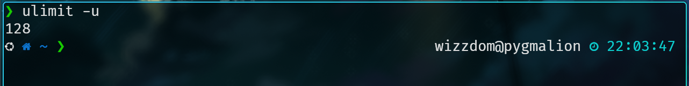
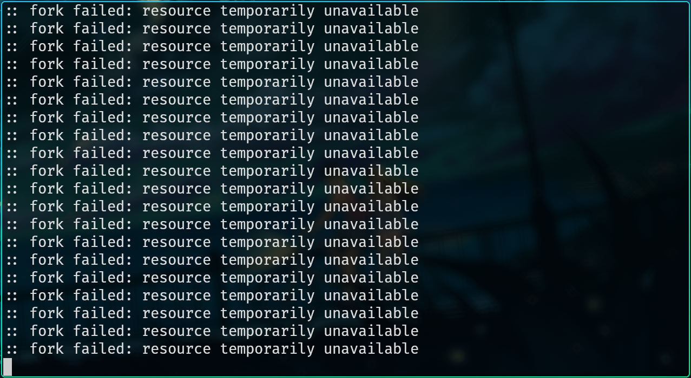
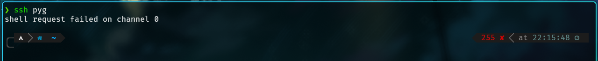

For nearly the entire existence of Redbrick, we have had login boxes that allow users to connect to via `ssh` or using [`wetty`](https://wetty.redbrick.dcu.ie). Our current ones being `pygmalion` and `azazel`. Users can login to these machines in order to access services such as: editing your webspace, accessing your mailbox from the terminal, testing out programming projects and much more. These have been proven as an invaluable part of Redbrick's services and this event showed us how important is is to harden and secure these boxes.

## What Happened?

### TL;DR: `:(){ :|:& };:`

### Okay, what *really* Happened?

A fork bomb is a type of attack where a program keeps forking itself recursively, the most common one on bash being `:(){ :|:& };:`. This keeps going until the machine is completely overwhelmed and grinds to a halt.

A certain enthusiastic redbrick member decided to "pen-test" our login boxes by running a fork bomb on them. You might think, *surely the admins before us have put measures in place to prevent this, right?* I'm afraid you would be mistaken, as was I. What followed was the complete lockup of `pygmalion`. 

## Finally, A Solution

We can set limits on how many processes a single user is allowed to have running simultaneously. This is configured in `/etc/security/limits.conf`:

```yml
root             hard    nproc      65536       # Prevent root from not being able to launch enough processes
# prevent fork bombs
*                hard    nproc      2048
@member          hard    nproc      128
@associat        hard    nproc      128
```

In other words:

- the `root` user can still run as many processes as it likes
- all redbrick members (those in the `member` or `associat` groups) are limited to 128 processes per user
- every other user (`*`) including admin accounts and system processes are limited to 2048 concurrent processes per user

Now we can test this by running `ulimit -u` for the given user and it should return the value we specified above. 



Now lets take it to the ***extreme*** and try running a fork bomb on `pyg`!



We can see that after a few seconds of running the fork bomb the limit is reached and the user is unable to spawn any new processes. This means the server stays up and running for everyone else. The only downside here is that any user who runs a fork bomb or otherwise hits this limit is unable to spawn a new shell and must either wait for the processes to die or [contact the admins](https://docs.redbrick.dcu.ie/contact/) to clear all processes on their account.



If you ever find yourself stuck or have any suggestions don't hesitate to [contact the admins](https://docs.redbrick.dcu.ie/contact/)!

Thanks for coming along for the ride!

`~wizzdom`
